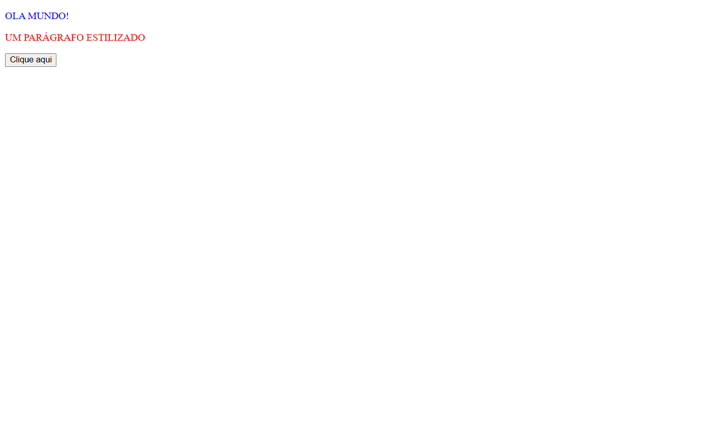

# Quest de React Basico

Esta é uma solução para a Quest de React Básico.

## Índice

- [Visão geral](#Visão-geral)
  - [O desafio](#o-desafio)
  - [Screenshots](#Screenshost)
- [Meu processo](#meu-processo)
  - [Construído com](#construido-com)
  - [O que aprendi](#o-que-aprendi)
  - [Desenvolvimento contínuo](#desenvolvimento-contínuo)
- [Autor](#autor)

## Visão geral

### O desafio

- Criar um componente que colore e transforma um texto em maiúsculo (uppercase) e mostrar mensagem com a label do botão.

### Screenshots

### Links
Live Site URL: [Quest](https://isabela-fernanda.github.io/Quest-React-Basico/)

## Meu processo

### Construído com

- Vite
- React

### O que aprendi

Foi minha primeira vez desenvolvendo e postando um projeto React do zero, o processo de postagem no GitHub teve vários passos adcionais para que tudo funcionasse corretamente, mas no fim consegui.

### Desenvolvimento contínuo

Planejo continuar focando em consolidar minhas habilidades em React.

## Autor

- Frontend Mentor - [@Isabela-Fernanda](https://www.frontendmentor.io/profile/Isabela-Fernanda)
- Gmail - [arty.7f@gmail.com](arty.7f@gmail.com)